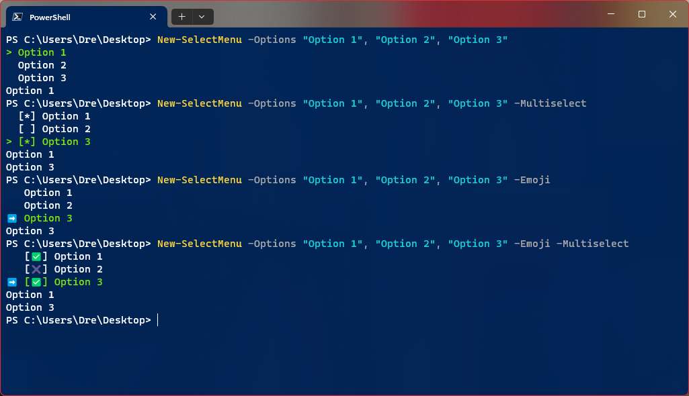

# Powershell Power Menu
Powershell module for creating arrow driven/multiselect menus. [See demo](https://cdn.deandrequeary.com/public/assets/img/power-menu-demo.mp4)

# Requirements
- Powershell 5.0+

# Manual Installation
1. Download zip
2. Copy files to `C:\Program Files\WindowsPowerShell\Modules\power-menu`
3. Run `Set-ExecutionPolicy Unrestricted` as Admin in PowerShell to enable running .ps1 scripts.
4. From `C:\Program Files\WindowsPowerShell\Modules`, run: `Import-Module Power-Menu`

# Usage
New-SelectMenu [option list] [command options]

Will return a single selected item or an array of items (if multiselect is set).

Will return `null` if `esc` key is pressed.

## Create Single Select Menu
`New-SelectMenu @("Option 1", "Option 2", "Option 3")`

## Creating Multiselect Menu
`New-SelectMenu @("Option 1", "Option 2", "Option 3") -Multiselect`

# Command Options
`Options` (array) - Array of menu options to display.

`Multiselect` - Display option list as multiselect menu and return selected options.

`Emoji` - Render menu options with emojis.

# Controls
    UP - go up
    DOWN - go down
    ENTER - select (single select)
    SPACE - select (multiselect)
    ESC - exit menu (returns null)

# Credits
This is a slightly modified version of ps-menu by chrisseroka. https://github.com/chrisseroka/ps-menu
